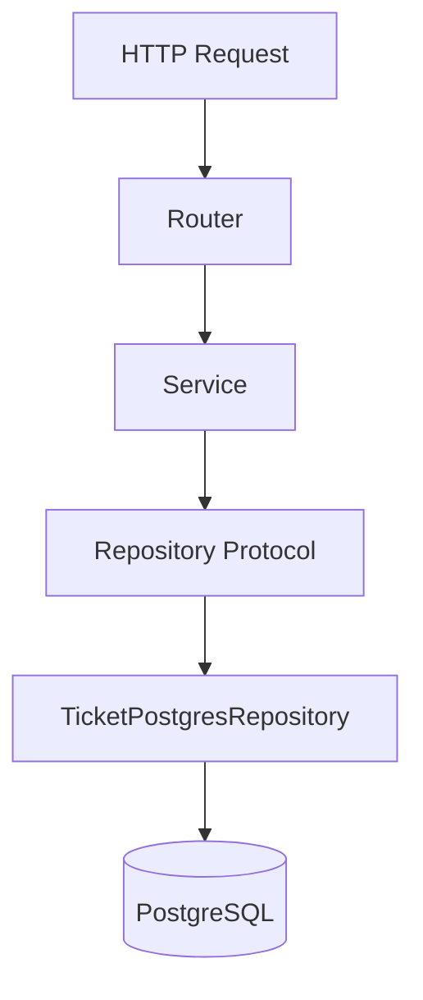
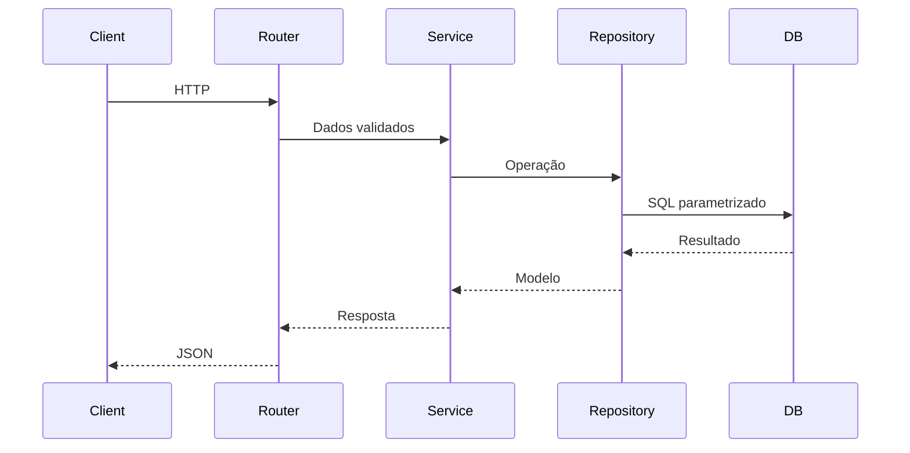

# Gerenciador de Tickets API

API REST desenvolvida em **Python**, utilizando **FastAPI** e **PostgreSQL**, criada como projeto prático durante uma trilha de estudos em Desenvolvimento Backend e Inteligência Artificial.

O objetivo do projeto é aplicar conceitos modernos de engenharia de software, evoluindo gradualmente de uma aplicação em terminal baseada em JSON para uma API estruturada em camadas, com foco em boas práticas, baixo acoplamento e facilidade de manutenção.

---

## 🚧 Status do Projeto

**Em desenvolvimento**

Evolução planejada:

- ✅ CRUD de Tickets
- ✅ FastAPI
- ✅ PostgreSQL
- ✅ Pydantic
- ✅ Repository Pattern
- ✅ Protocols
- ⏳ MongoDB
- ⏳ JWT
- ⏳ Docker
- ⏳ Integração com IA (LLMs/RAG)

---

## 📚 Sumário

- Tecnologias
- Funcionalidades
- Arquitetura
- Estrutura do Projeto
- Requisitos
- Quick Start
- Banco de Dados
- Configuração
- Endpoints
- Segurança
- Conceitos
- Roadmap
- Licença

---

## 🛠 Tecnologias

- Python 3.14
- FastAPI
- Uvicorn
- PostgreSQL
- Psycopg 3
- Pydantic
- python-dotenv
- Protocols (Duck Typing)

---

## ✨ Funcionalidades

- Criar tickets
- Listar tickets
- Buscar ticket por ID
- Alterar status
- Excluir tickets
- Filtrar por status
- Paginação (`limit` e `offset`)
- Documentação automática (Swagger/ReDoc)

---

## 🏛 Arquitetura



### Responsabilidades

- **Router:** camada HTTP.
- **Service:** regras de negócio.
- **Repository:** abstração da persistência.
- **PostgreSQL Repository:** implementação concreta.

### Fluxo da Requisição



---

## 📂 Estrutura do Projeto

```text
gerenciador_tickets/
├── database/
│   └── connection.py            # Conexão com PostgreSQL
├── dependencies.py              # Injeção de dependências
├── models/
├── repositories/
│   ├── ticket_postgres_repository.py
│   └── ticket_repository_protocol.py
├── routers/
├── schemas/
├── services/
├── .env
├── app.py
├── requirements.txt
└── README.md
```

---

## 📋 Requisitos

- Python 3.14+
- PostgreSQL

---

## 🚀 Quick Start

```bash
git clone <https://github.com/GabrielCNSouza/gerenciador_tickets>
cd gerenciador_tickets

python -m venv .venv

pip install -r requirements.txt

uvicorn app:app --reload
```

---

## ⚙ Configuração

### Criar ambiente virtual

```bash
python -m venv .venv
```

### Ativar

Windows PowerShell

```powershell
.\.venv\Scripts\Activate.ps1
```

Windows CMD

```cmd
.venv\Scripts\activate.bat
```

Linux/macOS

```bash
source .venv/bin/activate
```

### Variáveis de ambiente

```env
DB_HOST=localhost
DB_PORT=5432
DB_NAME=tickets_db
DB_USER=postgres
DB_PASSWORD=sua_senha
```

### Executar

```bash
uvicorn app:app --reload
```

---

## 🗄 Banco de Dados

```sql
CREATE TABLE ticket_status (
    id SERIAL PRIMARY KEY,
    nome TEXT NOT NULL UNIQUE
);

CREATE TABLE tickets (
    id SERIAL PRIMARY KEY,
    titulo TEXT NOT NULL,
    descricao TEXT NOT NULL,
    status_id INT NOT NULL REFERENCES ticket_status(id)
);
```

### Constraints

```sql
ALTER TABLE tickets
ADD CONSTRAINT chk_titulo_nao_vazio
CHECK(length(trim(titulo)) > 0);

ALTER TABLE tickets
ADD CONSTRAINT chk_descricao_nao_vazia
CHECK(length(trim(descricao)) > 0);
```

---

## 🌐 Endpoints

| Método | Endpoint | Descrição |
|---|---|---|
| GET | /health | Health Check |
| GET | /tickets | Lista tickets |
| GET | /tickets/{id} | Busca ticket |
| POST | /tickets | Cria ticket |
| PATCH | /tickets/{id}/status | Atualiza status |
| DELETE | /tickets/{id} | Remove ticket |

### Exemplo de criação

```bash
curl -X POST http://127.0.0.1:8000/tickets \
-H "Content-Type: application/json" \
-d '{"titulo":"Erro","descricao":"Falha no login"}'
```

### Exemplo de atualização

```bash
curl -X PATCH http://127.0.0.1:8000/tickets/1/status \
-H "Content-Type: application/json" \
-d '{"status":"em andamento"}'
```

---

## 🔒 Segurança

- SQL parametrizado (proteção contra SQL Injection)
- Credenciais em `.env`
- Validação com Pydantic
- Separação em camadas
- Baixo acoplamento via Protocols

---

## 🧠 Conceitos Praticados

- POO
- FastAPI
- Repository Pattern
- Protocols
- Injeção de Dependência
- Arquitetura em Camadas
- PostgreSQL
- SQL parametrizado
- CRUD
- Paginação
- OpenAPI

---

## 🚀 Roadmap

- MongoDB
- JWT
- Docker
- Testes automatizados
- IA (LLMs/RAG)

---

## 👤 Autor

Projeto desenvolvido por **Gabriel** durante sua trilha de estudos em Python, Backend e Inteligência Artificial.

---

## 📄 Licença

Projeto desenvolvido para fins de estudo. Sinta-se à vontade para utilizá-lo como referência, mantendo os devidos créditos.
